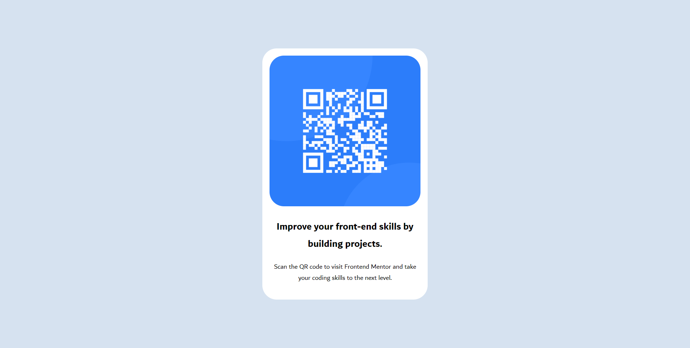

# Frontend Mentor - QR code component solution

This is a solution to the [QR code component challenge on Frontend Mentor](https://www.frontendmentor.io/challenges/qr-code-component-iux_sIO_H). Frontend Mentor challenges help you improve your coding skills by building realistic projects.

## Table of contents

- [Overview](#overview)
  - [Screenshot](#screenshot)
  - [Links](#links)
- [My process](#my-process)
  - [Built with](#built-with)
  - [What I learned](#what-i-learned)
  - [Continued development](#continued-development)
  - [Useful resources](#useful-resources)s

## Overview

### Screenshot



### Links

- Solution URL: [Add solution URL here](https://your-solution-url.com)
- Live Site URL: [Add live site URL here](https://your-live-site-url.com)

## My process

### Built with

- Semantic HTML5 markup
- Flexbox
- CSS
- Visual Studio Code

### What I learned

- `<body>` and most block elements take up the height of their content
- To make images scalable, use:

```css
width: 100%;
```

- To center any element, best option is flexbox.
- An `<h1>` tag in an `<aside>` tag has a default 1.5em font-size
- A `<p>` tag in an `<aside>` tag has a default 1em font-size

### Continued development

- Implement a good box-shadow around the component

### Useful resources

- [MDN Docs > Guides](hhttps://developer.mozilla.org/en-US/docs/Learn_web_development/Core/Styling_basics) - Very comprehensive and thorough explanasion
- [How To Center a Div
  ](https://www.joshwcomeau.com/css/center-a-div) - Explains the differnet methods to center a div. Very recent.
